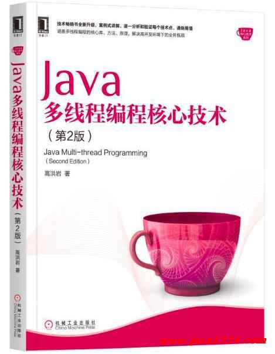

# JavaMPCore
Java多线程编程核心技术（第2版）
上周看了下这本书, 很多代码例子, 比较好理解, 先都敲一遍.

全书共7章。
第1章讲解了Java多线程的基础，重点介绍线程类的核心API的使用。
第2讲解对并发访问的控制，即如何写出线程安全的程序。
第3章介绍线程间通信，以提高CPU利用率和系统间的交互，同时增强对线程任务的把控与监督。
第4章讲解Lock对象，以更好实现并发访问时的同步处理。
第5章讲解移动开发中使用较多的定时器类中的多线程技术，这是计划/任务执行里很重要的技术点。
第6章讲解如何安全、正确地将单例模式与多线程技术相结合，避免实际应用中可能会出现的麻烦。
第7章将前面被遗漏的技术案例在本章节中进行补充，尽量做到不出现技术空白点。

## 目录
前言
### 第1章　Java多线程技能1
1.1　进程和多线程概述1
1.2　使用多线程5
1.2.1　继承Thread类5
1.2.2　使用常见命令分析线程的信息8
1.2.3　线程随机性的展现11
1.2.4　执行start()的顺序不代表执行run()的顺序12
1.2.5　实现Runnable接口13
1.2.6　使用Runnable接口实现多线程的优点14
1.2.7　实现Runnable接口与继承Thread类的内部流程16
1.2.8　实例变量共享造成的非线程安全问题与解决方案17
1.2.9　Servlet技术造成的非线程安全问题与解决方案21
1.2.10　留意i--与System.out.println()出现的非线程安全问题24
1.3　currentThread()方法26
1.4　isAlive()方法29
1.5　sleep(long millis)方法31
1.6　sleep(long millis, int nanos)方法33
1.7　StackTraceElement[] getStackTrace()方法33
1.8　static void dumpStack()方法35
1.9　static Map getAllStackTraces()方法36
1.10　getId()方法38
1.11　停止线程38
1.11.1　停止不了的线程39
1.11.2　判断线程是否为停止状态41
1.11.3　能停止的线程—异常法43
1.11.4　在sleep状态下停止线程47
1.11.5　用stop()方法暴力停止线程49
1.11.6　stop()方法与java.lang.ThreadDeath异常51
1.11.7　使用stop()释放锁给数据造成不一致的结果52
1.11.8　使用“return;”语句停止线程的缺点与解决方案54
1.12　暂停线程57
1.12.1　suspend()方法与resume()方法的使用57
1.12.2　suspend()方法与resume()方法的缺点—独占58
1.12.3　suspend()方法与resume()方法的缺点—数据不完整62
1.13　yield()方法63
1.14　线程的优先级64
1.14.1　线程优先级的继承特性65
1.14.2　优先级的规律性66
1.14.3　优先级的随机性68
1.14.4　优先级对线程运行速度的影响70
1.15　守护线程71
1.16　本章小结73
### 第2章　对象及变量的并发访问74
2.1　synchronized同步方法74
2.1.1　方法内的变量为线程安全74
2.1.2　实例变量非线程安全问题与解决方案77
2.1.3　同步synchronized在字节码指令中的原理80
2.1.4　多个对象多个锁81
2.1.5　将synchronized方法与对象作为锁84
2.1.6　脏读89
2.1.7　synchronized锁重入91
2.1.8　锁重入支持继承的环境93
2.1.9　出现异常，锁自动释放94
2.1.10　重写方法不使用synchronized96
2.1.11　public static boolean holdsLock(Object obj)方法的使用99
2.2　synchronized同步语句块99
2.2.1　synchronized方法的弊端99
2.2.2　synchronized同步代码块的使用102
2.2.3　用同步代码块解决同步方法的弊端104
2.2.4　一半异步，一半同步105
2.2.5　synchronized代码块间的同步性108
2.2.6　println()方法也是同步的110
2.2.7　验证同步synchronized(this)代码块是锁定当前对象的110
2.2.8　将任意对象作为锁113
2.2.9　多个锁就是异步执行116
2.2.10　验证方法被调用是随机的118
2.2.11　不同步导致的逻辑错误及其解决方法121
2.2.12　细化验证3个结论124
2.2.13　类Class的单例性129
2.2.14　静态同步synchronized方法与synchronized(class)代码块130
2.2.15　同步syn static方法可以对类的所有对象实例起作用135
2.2.16　同步syn(class)代码块可以对类的所有对象实例起作用137
2.2.17　String常量池特性与同步相关的问题与解决方案138
2.2.18　同步synchronized方法无限等待问题与解决方案141
2.2.19　多线程的死锁143
2.2.20　内置类与静态内置类146
2.2.21　内置类与同步：实验1149
2.2.22　内置类与同步：实验2151
2.2.23　锁对象改变导致异步执行153
2.2.24　锁对象不改变依然同步执行156
2.2.25　同步写法案例比较158
2.3　volatile关键字159
2.3.1　可见性的测试159
2.3.2　原子性的测试168
2.3.3　禁止代码重排序的测试176
2.4　本章小结187
### 第3章　线程间通信188
3.1　wait/notify机制188
3.1.1　不使用wait/notify机制实现线程间通信188
3.1.2　wait/notify机制191
3.1.3　wait/notify机制的原理192
3.1.4　wait()方法的基本使用192
3.1.5　完整实现wait/notify机制194
3.1.6　使用wait/notify机制实现list.size()等于5时的线程销毁195
3.1.7　对业务代码进行封装198
3.1.8　线程状态的切换201
3.1.9　wait()方法：立即释放锁202
3.1.10　sleep()方法：不释放锁203
3.1.11　notify()方法：不立即释放锁204
3.1.12　interrupt()方法遇到wait()方法206
3.1.13　notify()方法：只通知一个线程208
3.1.14　notifyAll()方法：通知所有线程211
3.1.15　wait(long)方法的基本使用212
3.1.16　wait(long)方法自动向下运行需要重新持有锁214
3.1.17　通知过早问题与解决方法217
3.1.18　wait条件发生变化与使用while的必要性220
3.1.19　生产者/消费者模式的实现224
3.1.20　通过管道进行线程间通信—字节流250
3.1.21　通过管道进行线程间通信—字符流253
3.1.22　实现wait/notify的交叉备份256
3.2　join()方法的使用259
3.2.1　学习join()方法前的铺垫259
3.2.2　join()方法和interrupt()方法出现异常261
3.2.3　join(long)方法的使用263
3.2.4　join(long)方法与sleep(long)方法的区别264
3.2.5　join()方法后面的代码提前运行—出现意外 268
3.2.6　join()方法后面的代码提前运行—解释意外270
3.2.7　join(long millis, int nanos)方法的使用273
3.3　类ThreadLocal的使用273
3.3.1　get()方法与null274
3.3.2　类ThreadLocal存取数据流程分析275
3.3.3　验证线程变量的隔离性277
3.3.4　解决get()方法返回null的问题282
3.3.5　验证重写initialValue()方法的隔离性283
3.4　类InheritableThreadLocal的使用284
3.4.1　类ThreadLocal不能实现值继承285
3.4.2　使用InheritableThreadLocal体现值继承特性286
3.4.3　值继承特性在源代码中的执行流程288
3.4.4　父线程有最新的值，子线程仍是旧值291
3.4.5　子线程有最新的值，父线程仍是旧值293
3.4.6　子线程可以感应对象属性值的变化294
3.4.7　重写childValue()方法实现对继承的值进行加工297
3.5　本章小结298
### 第4章　Lock对象的使用299
4.1　使用ReentrantLock类299
4.1.1　使用ReentrantLock实现同步299
4.1.2　验证多代码块间的同步性301
4.1.3　await()方法的错误用法与更正304
4.1.4　使用await()和signal()实现wait/notify机制307
4.1.5　await()方法暂停线程运行的原理309
4.1.6　通知部分线程—错误用法312
4.1.7　通知部分线程—正确用法314
4.1.8　实现生产者/消费者模式一对一交替输出317
4.1.9　实现生产者/消费者模式多对多交替输出319
4.1.10　公平锁与非公平锁321
4.1.11　public int getHoldCount()方法的使用324
4.1.12　public final int getQueue Length()方法的使用325
4.1.13　public int getWaitQueue-Length (Condition condition)方法的使用327
4.1.14　public final boolean has-QueuedThread (Thread thread)方法的使用328
4.1.15　public final boolean has-QueuedThreads()方法的使用329
4.1.16　public boolean hasWaiters (Con-dition condition)方法的使用331
4.1.17　public final boolean isFair()方法的使用332
4.1.18　public boolean isHeldBy-CurrentThread()方法的使用333
4.1.19　public boolean isLocked()方法的使用334
4.1.20　public void lockInterruptibly()方法的使用335
4.1.21　public boolean tryLock()方法的使用336
4.1.22　public boolean tryLock (long timeout, TimeUnit unit)方法的使用338
4.1.23　public boolean await (long time, TimeUnit unit)方法的使用339
4.1.24　public long awaitNanos(long nanosTimeout)方法的使用341
4.1.25　public boolean awaitUntil(Date deadline)方法的使用342
4.1.26　public void awaitUninterru-ptibly()方法的使用344
4.1.27　实现线程按顺序执行业务346
4.2　使用ReentrantReadWriteLock类349
4.2.1　ReentrantLock类的缺点349
4.2.2　ReentrantReadWriteLock类的使用—读读共享351
4.2.3　ReentrantReadWriteLock类的使用—写写互斥352
4.2.4　ReentrantReadWriteLock类的使用—读写互斥352
4.2.5　ReentrantReadWriteLock类的使用—写读互斥354
4.3　本章小结355
### 第5章　定时器Timer356
5.1　定时器Timer的使用356
5.1.1　schedule(TimerTask task, Datetime)方法的测试356
5.1.2　schedule(TimerTask task, Date firstTime, long period)方法的测试366
5.1.3　schedule(TimerTask task, long delay)方法的测试374
5.1.4　schedule(TimerTask task, long delay, long period)方法的测试374
5.1.5　scheduleAtFixedRate (TimerTask task, Date firstTime, long period)方法的测试375
5.2　本章小结384
### 第6章　单例模式与多线程385
6.1　立即加载/饿汉模式385
6.2　延迟加载/懒汉模式387
6.2.1　延迟加载/懒汉模式解析387
6.2.2　延迟加载/懒汉模式的缺点388
6.2.3　延迟加载/懒汉模式的解决方案390
6.3　使用静态内置类实现单例模式399
6.4　序列化与反序列化的单例模式实现400
6.5　使用static代码块实现单例模式402
6.6　使用enum枚举数据类型实现单例模式404
6.7　完善使用enum枚举数据类型实现单例模式405
6.8　本章小结407
### 第7章　拾遗增补408
7.1　线程的状态408
7.1.1　验证NEW、RUNNABLE和TERMINATED410
7.1.2　验证TIMED_WAITING411
7.1.3　验证BLOCKED412
7.1.4　验证WAITING414
7.2　线程组415
7.2.1　线程对象关联线程组：一级关联416
7.2.2　线程对象关联线程组：多级关联417
7.2.3　线程组自动归属特性418
7.2.4　获取根线程组419
7.2.5　线程组中加线程组420
7.2.6　组内的线程批量停止421
7.2.7　递归取得与非递归取得组内对象422
7.3　Thread.activeCount()方法的使用423
7.4　Thread.enumerate(Thread tarray[])方法的使用423
7.5　再次实现线程执行有序性424
7.6　SimpleDateFormat非线程安全426
7.6.1　出现异常426
7.6.2　解决异常的方法1428
7.6.3　解决异常的方法2430
7.7　线程中出现异常的处理431
7.7.1　线程出现异常的默认行为431
7.7.2　使用setUncaughtException-Handler()方法进行异常处理432
7.7.3　使用setDefaultUncaughtExce-ptionHandler()方法进行异常处理433
7.8　线程组内处理异常434
7.9　线程异常处理的优先性437
7.10　本章小结442

## 一些参考链接
程序员电子书免费下载
https://gitee.com/wufeitong/coderbook

CodeGuide | 程序员编码指南
https://github.com/fuzhengwei/CodeGuide/tree/master