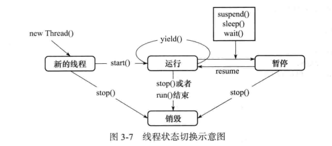

## wait/notify 通信机制
不同于等待查询机制, `wait/notify`通信机制更类似于中断机制, 当一个线程需要等待一些消息时, 它会先进入沉睡, 随后消息放出后, 它就会再次醒来.

方法 wait() 的作用是使当前执行代码的线程进行等待, wait() 方法是 Object 类的方法该方法用来将当前线程置入 "预执行队列" 中, 并且在 wait() 所在的代码行处停执行, 直到接到通知或被中断为止。**在调用 wait() 之前, 线程必须获得该对象的对象级别锁, 即只能在同步方法或同步块中调用 wait() 方法**。在执行 wait() 方法后, 当前线程释放锁。在从 wait() 返回前，线程与其他线程竞争重新获得锁。如果调用 wait()时没有持有适当的锁，则抛出`IllegalMonitorStateException`，它是 `RuntimeException` 的一个子类，因此，不需要 `trycatch` 语句进行捕捉异常。

方法 `notify()` 也要在同步方法或同步块中调用, 即在调用前, 线程也必须获得该对象的对象级别锁. 如果调用 `notify()` **时没有持有适当的锁, 也会抛出 `IllegalMonitorStateException`. 该方法用来通知那些可能等待该对象的对象锁的其他线, ，如果有多个线程等待, 则由线程规划器随机挑选出其中一个呈 `wait` 状态的线程, 对其发出通知 `notify`, 并使它等待获取该对象的对象锁.** 需要说明的是，在执行 `notify()` 方法后，当前线程不会马上释放该对象锁, `wait` 状态的线程也并不能马上获取该对象锁, 要等到执行 `notify()` 方法的线程将程序执行完, 也就是退出 synchronized 代码块后，当前线程才会释放锁，而呈 wait 状态所在的线程才可以获取该对象锁。当第一个获得了该对象锁的 wait 线程运行完毕以后，它会释放掉该对象锁，此时如果该对象没有再次使用 notify 语句，则即便该对象已经空闲，其他 wait 状态等待的线程由于没有得到该对象的通知，还会继续阻塞在 wait 状态，直到这个对象发出一个notify 或 notifyAll.

## 线程状态


(1) 新创建一个新的线程对象后，再调用它的 start() 方法，系统会为此线分配 CPU资源，使其处于 `Runnable(可运行)` 状态，这是一个准备运行的阶段。如果线程抢占到CPU资源，此线程就处于 `Running(运行)` 状态。
(2) `Runnable状态` 和 `Running状态` 可相互切换，因为有可能线运行一段时间后，有其他高优先级的线程抢占了CPU资源，这时此线程就从 Running状态 变成 Runnable状态 线程. 进入Runnable状态大体分为如下5种情况:
```
a. 调用sleep()方法后经过的时间超过了指定的休眠时间;
b. 线程调用的阻塞IO已经返回，阻塞方法执行完毕;
c. 线程成功地获得了试图同步的监视器;
d. 线程正在等待某个通知，其他线程发出了通知;
e. 处于挂起状态的线程调用了 resume 恢复方法.
```
(3) `Blocked` 是阻塞的意思，例如遇到了一个IO操作，此时 CPU 处于空闲状态，可能会转而把CPU 时间片分配给其他线程, Blocked 状态结束后进入Runnable 状态，等待系统重新分配资源. 出现阻塞的情况大体分为如下5种:
```
a. 线程调用 sleep 方法，主动放弃占用的处理器资源.
b. 线程调用了阻塞式IO方法，在该方法返回前，该线程被阻塞.
c. 线程试图获得一个同步监视器，但该同步监视器正被其他线程所持有.
d. 线程等待某个通知.
e. 程序调用了 suspend 方法将该线程挂起。此方法容易导致死锁，尽量避免使用该方法.
```
run()方法运行结束后进入销毁阶段，整个线程执行完毕. 每个锁对象都有两个队列, 一个是就绪队列, 一个是阻塞队列. 就绪队列存储了将要获得锁的线程, 阻寒队列存储了被阻塞的线程. 一个线程被唤醒后, 才会进入就绪队列, 等待CPU 的调度; 反之, 一个线程被 wait 后, 就会进入阻塞队列, 等待下一次被唤醒.

## wn 锁机制
从附录代码1中可以了解到, `waiting()` 方法是立即释放锁的, 也即线程执行 waiting 方法后自行阻塞并放弃锁, 在输出中, 并不是一个线程执行到`end waiting`之后才会有其他线程进入`begin waiting`阶段, 而是各线程都可以进入同步语句块(这就体现了waiting方法立即释放锁的特点).

与之形成对比的是, `notify()` 所在语句块总是依次执行的, 这说明 `notify()` 方法在进行消息通知之后并不立即释放锁.

值得注意的是, 程序最后输出中并未出现`"All thread exit normally."`, 也即有些线程还在 waiting 中并未被唤醒, 这是由于 notify() 方法仅仅唤醒该对象锁上阻塞队列的某一个线程, 而被用于进行 notify 操作的线程有一些过早执行了, 导致部分等待的线程未被通知到. 

一个解决方法是使用 `notifyAll`, 可以看到, 唤醒顺序并没有规律.

### sleep 与 wait
调用 sleep() 会使线程进入睡眠, 但此时线程不会放弃锁.

### wait 条件变化
wait 条件变化和 while 的必要性.
需要模拟这样一种情况, 有一个共享的列表, 初始大小为0, 一些线程向其中添加元素, 另一些线程删除其中的元素. 注意删除前需要判断列表是否为空。


## 代码附录(code)
### 1. wait/notify 基本使用
```java
public class WNUsage {
    private final Object lock = new Object();
    // 1. wait method
    public void wtMessage() throws InterruptedException {
        synchronized (lock){
            System.out.println("Thread "+Thread.currentThread().getName()+" start waiting ... ...");
            lock.wait();
            System.out.println("Thread "+Thread.currentThread().getName()+" end waiting.");
        }
    }
    
    // 2. notify method
    public void nfMessage(){
        synchronized (lock){
            System.out.println("Thread "+Thread.currentThread().getName()+" begin to notify ... ...");
            lock.notify();
            System.out.println("Thread "+Thread.currentThread().getName()+" notify finished.");
        }
    }

    public static void main(String[] args) throws InterruptedException {
        WNUsage usage = new WNUsage();
        final int thread_num = 10;
        Thread[] threads = new Thread[thread_num];
        // 5个线程进入等待, 5个线程进行通知
        for(int i=0; i<thread_num/2; i++){
            threads[i] = new Thread(()->{
                try{
                    usage.wtMessage();
                }catch (InterruptedException e){
                    e.printStackTrace();
                }
            });
            threads[i].setName("Thread(wait): "+i);
            threads[thread_num-i-1] = new Thread(usage::nfMessage);
            threads[thread_num-i-1].setName("Thread(notify): "+(thread_num-i-1));
        }
        // 依次启动它们
        for(Thread t: threads)
            t.start();
        // main 线程等待这些线程执行结束(真的可以等到吗)
        for(Thread t: threads)
            t.join();
        System.out.println("All thread exit normally.");
    }
}

"""
Thread Thread(wait): 0 start waiting ... ...
Thread Thread(notify): 9 begin to notify ... ...
Thread Thread(notify): 9 notify finished.
Thread Thread(notify): 8 begin to notify ... ...
Thread Thread(notify): 8 notify finished.
Thread Thread(notify): 7 begin to notify ... ...
Thread Thread(notify): 7 notify finished.
Thread Thread(wait): 3 start waiting ... ...
Thread Thread(wait): 2 start waiting ... ...
Thread Thread(wait): 4 start waiting ... ...
Thread Thread(notify): 6 begin to notify ... ...
Thread Thread(notify): 6 notify finished.
Thread Thread(notify): 5 begin to notify ... ...
Thread Thread(notify): 5 notify finished.
Thread Thread(wait): 1 start waiting ... ...
Thread Thread(wait): 2 end waiting.
Thread Thread(wait): 3 end waiting.
Thread Thread(wait): 0 end waiting.

"""
```

### notifyAll
在上面的代码中添加一些代码进行测试
```java
public void nfMessageAll(){
    synchronized (lock){
        System.out.println("Thread "+Thread.currentThread().getName()+" begin to notify ... ...");
        lock.notifyAll();
        System.out.println("Thread "+Thread.currentThread().getName()+" notify finished.");
    }
}

public static void testNotifyAll(){
    WNUsage usage = new WNUsage();
    final int thread_num = 5;
    Thread[] th_w = new Thread[thread_num];
    // 1. 创建5个 waiting 线程
    for(int i=0; i<thread_num; i++){
        th_w[i] = new Thread(()->{
            try{
                usage.wtMessage();
            }catch (InterruptedException e){
                e.printStackTrace();
            }
        });
        th_w[i].setName("Waiter "+i);
    }
    // 2. waiting 线程先启动
    for(int i=0; i<thread_num; i++)
        th_w[i].start();
    // 3. 等待一些时日
    try{
        Thread.sleep(300);
    }catch (InterruptedException e){
        e.printStackTrace();
    }
    // 4. 发出通知
    Thread n = new Thread(usage::nfMessageAll);
    n.setName("Notifier");
    n.start();
}
"""
Thread Waiter 0 start waiting ... ...
Thread Waiter 3 start waiting ... ...
Thread Waiter 4 start waiting ... ...
Thread Waiter 2 start waiting ... ...
Thread Waiter 1 start waiting ... ...
Thread Notifier begin to notify ... ...
Thread Notifier notify finished.
Thread Waiter 0 end waiting.
Thread Waiter 1 end waiting.
Thread Waiter 2 end waiting.
Thread Waiter 4 end waiting.
Thread Waiter 3 end waiting.
"""
```


